# Liareth's Snazzy Bot image generation

## Step 1: Create a prompt

Prompts are comprised of two components: the *prompt* and the *negative-prompt*. The *prompt* allows you to guide generation towards a set of concepts. In contrast, the *negative-prompt* allows you guide the bot away from a set of concepts. Both the *prompt* and *negative-prompt* work best when provided by a series of comma-separated phrases or words. The words at the start of each list have a greater weight, so make sure to put key concepts first.

**Example:** *prompt*: female elven monk, black clothing, strong, assassin *negative-prompt*: bald, asian, large breasts, weapon, staff

You may wish to make use of the `/prompt` feature of the bot, which can take a body of text (story/description/etc) and constructs the *prompt* component for you.

**Example (input):** There was no hope, no glimmering star of dissension, no whispered insurrections. There was only Seraphina, her dark reign engraved in the millennia to come. Her victory was the empire's perpetual night, and her rule the unending eclipse. Beneath the cloak of the authoritarian empress, the cosmos was plunged into a darkness so profound it echoed the distance between stars: endless, infinite, and utterly oppressive.

**Example (output):** Female Emperor, sinister, draped in darkness, infinite expanse of the cosmos, endless oppression, a reign written in the stars, oppressive eclipse, celestial, dark empire

## Step 2: Generate the images

It's time to generate your images by using `/img generate`. I recommend choosing a *gen-style* which helps to guide the AI towards a particular style or genre. It does not always improve the image, but it will help to produce stylistically consistent images.

**Example**: `/img generate prompt: female elven monk, black clothing, strong, assassin negative-prompt: bald, asian, large breasts, weapon, staff`

|             Disabled              |        DungeonsAndDragons         |           Warhammer 40k                 
:----------------------------------:|:---------------------------------:|:---------------------------------:
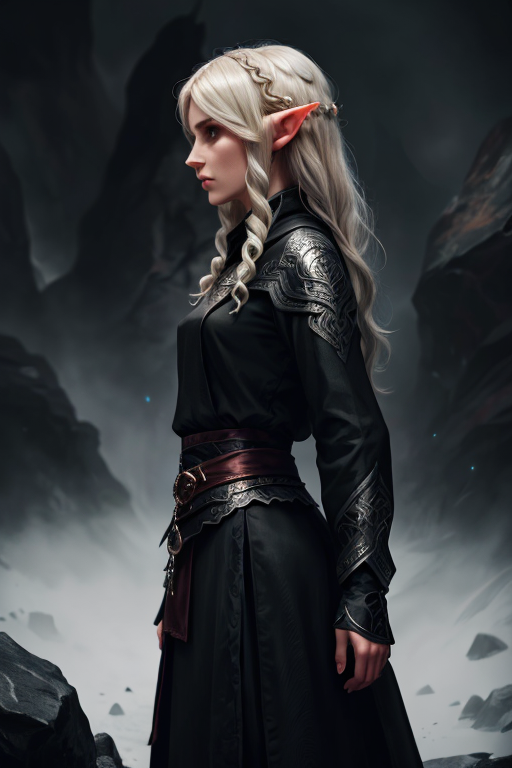    | 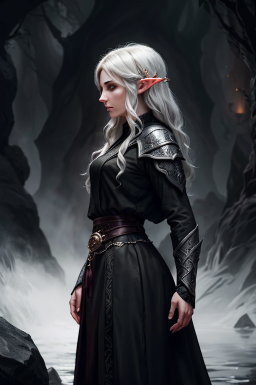       | 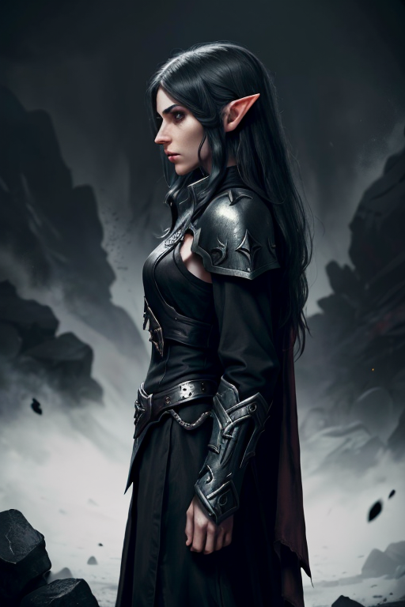
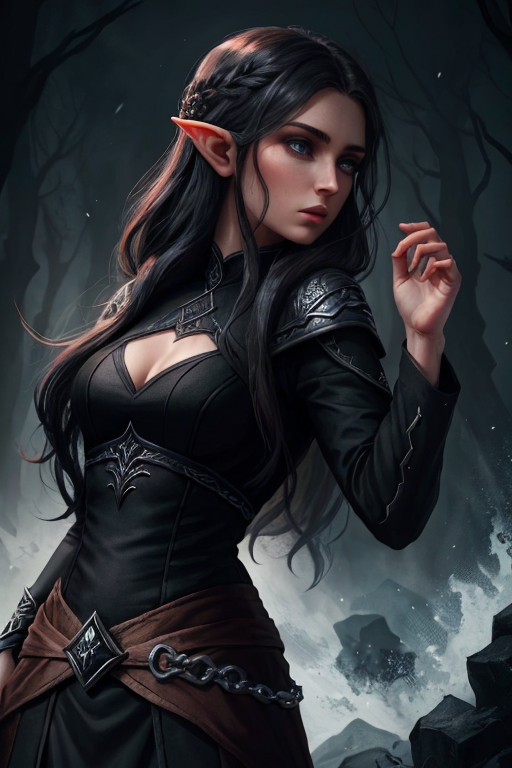    | 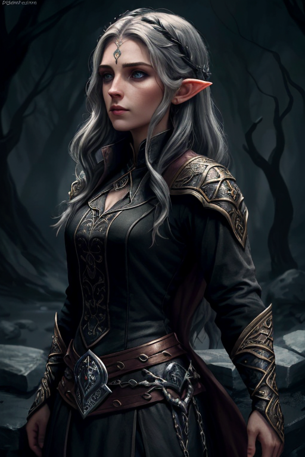       | 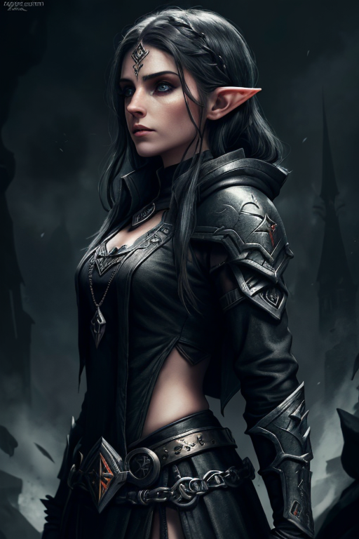
 
## Step 3: Generate variations

Once you've found an image you like, you may wish to create variations of that image. To do this, you may use the `/img variations` command. This command requires the original file generated by `/img generate` including the same file name, as it encodes metadata about the original generation in the file name. You can provide a *closeness* value which determines how closely the generation will adhere to the original image.

|           Very closely            |             Closely               |             Standard              |                 Little            |        Very little
:----------------------------------:|:---------------------------------:|:---------------------------------:|:---------------------------------:|:---------------------------------:
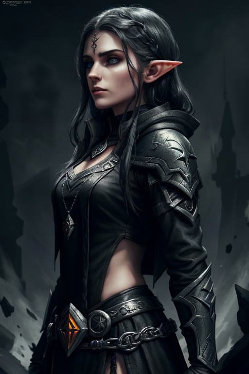      | 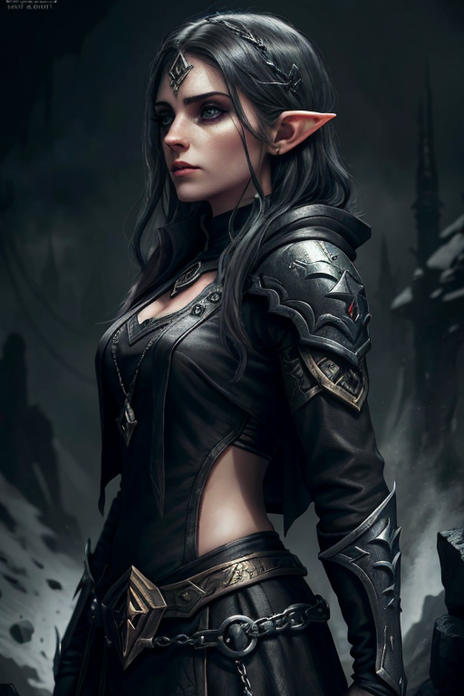    | 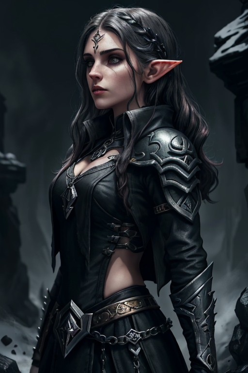    | 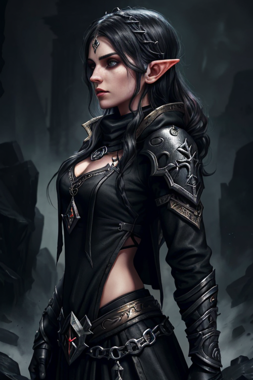    | 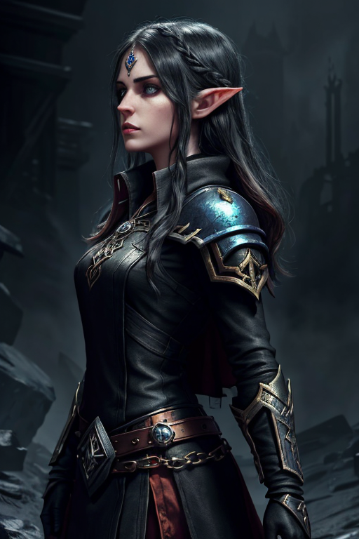
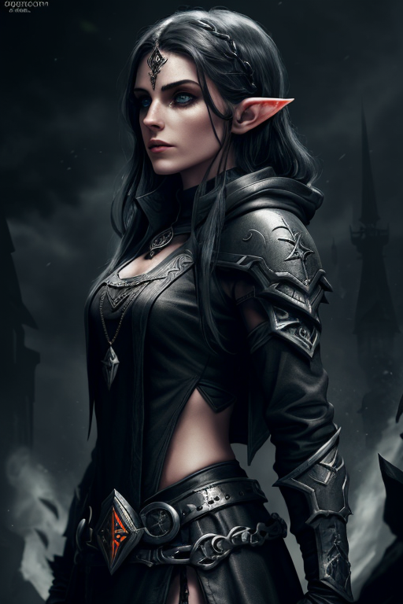      | 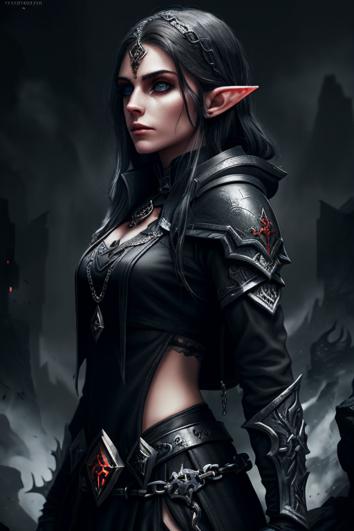    | 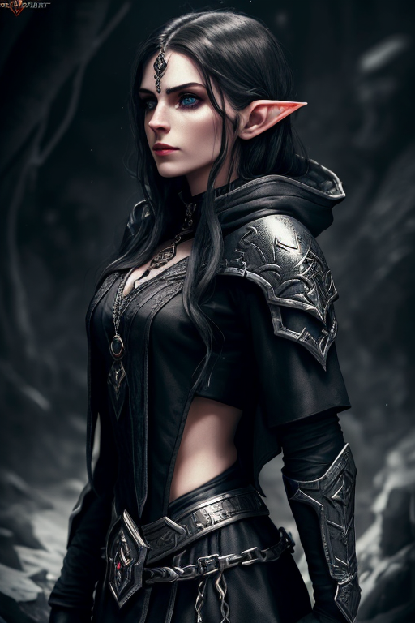    | 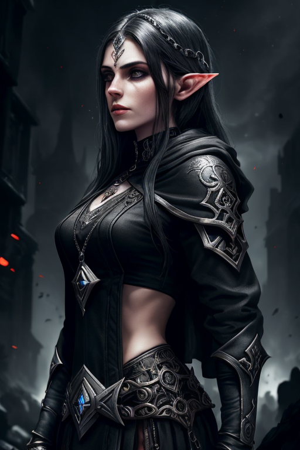    | 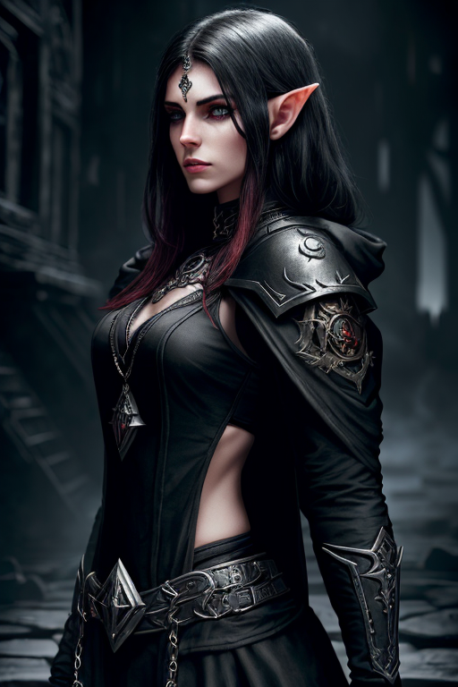
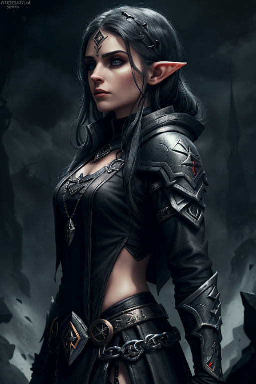      | 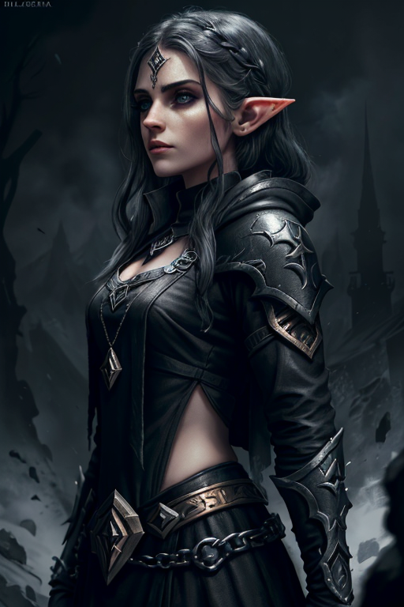    | 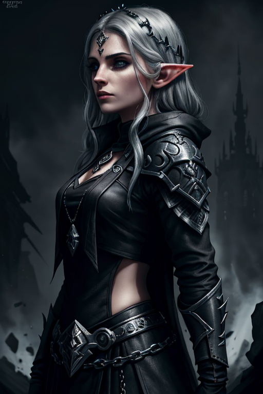    | 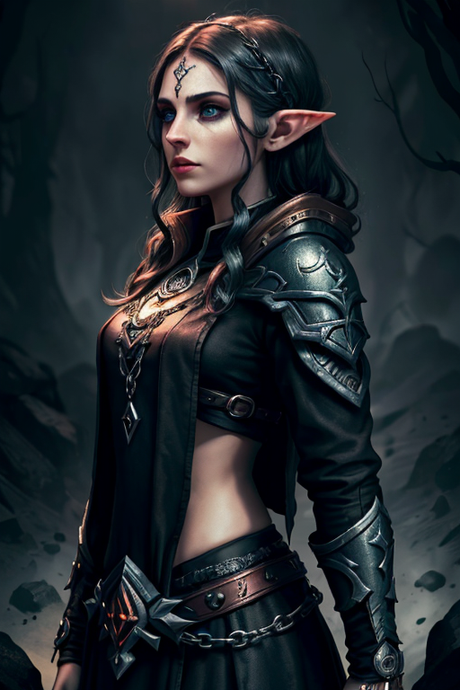    | 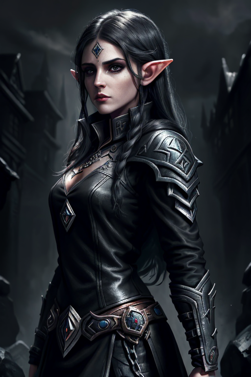

## Step 3: Upscale your image

Once you've found the final image that you want to use (which may take more passes, variations on variations, and you may wish to manually touch up the image too) upscale it using `/img upscale`, which will upscale it into 4k.

|           Upscaled                |  
:----------------------------------:|
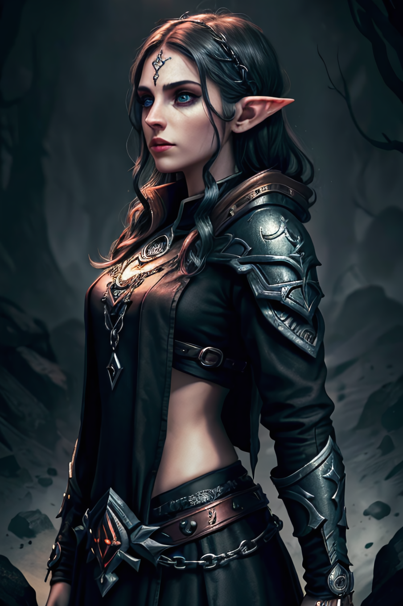

## Advanced usage

There are a bunch of advanced features! I won't explain them all, yet, but here are some examples:

* `/img generate` takes *inspiration*, which takes an initial image to generate a new one based off, and *seed*, which you can use to get deterministic results.
* `/img variations` takes *prompt-guidance* and *negative-prompt-guidance*, which can help to make subtle tweaks to the image, for example changing hair or eye colour.
